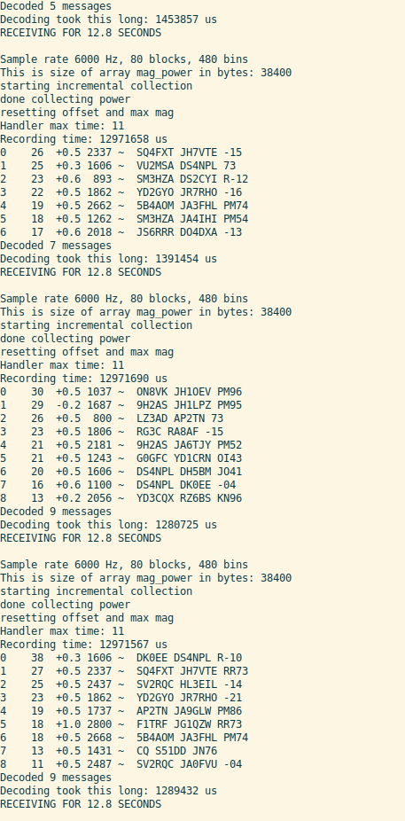
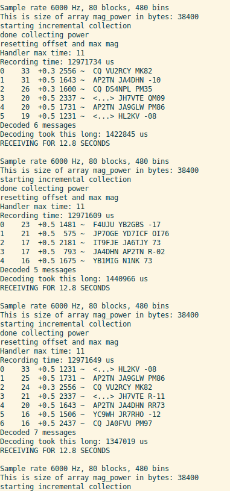

### Raspberry Pi 'Pico W' FT8 Decoder + Spotter

Solar-powered WiFi-enabled FT8 decoder, and spotter using a Raspberry Pi Pico W
board.

Currently, it is able to decode live audio signals that are input into the ADC
(GPIO 26), displaying them on the serial port.

This firmware is written for the [PDX++ project](https://github.com/kholia/Easy-Transceiver/tree/master/PDX++).


#### Hardware Requirements

- Raspberry Pi Pico W board


#### Connections

Si5351 (used for TX):

- SDA to GPIO16
- SCL to GPIO17

ADC on GPIO26.


#### Build Steps

Follow https://github.com/raspberrypi/pico-sdk#quick-start-your-own-project

```
mkdir -p ~/repos

cd ~/repos

git clone https://github.com/raspberrypi/pico-sdk.git

export PICO_SDK_PATH=${HOME}/repos/pico-sdk

git clone https://github.com/kholia/SunshineFT8.git

cd SunshineFT8

make -f Makefile.PicoW

make
```

Done. At the end of this process a `run_ft8.uf2` file is generated which can be
uploaded to the `Pico W` board.


#### Testing

Live decoding works great with the audio feed coming from a uBITX transceiver.



Pico (in ML76 grid) even decoded a US station - lucky timing!




#### Misc Notes

Folks have done FT8 decoding on STM32F7, and Teensy 3.6 before.

However, STM32 stuff is unobtanium (and expensive) in year 2022. At almost half
the Teensy 3.6's price point, the RPi 2W is a much better platform for decoding
FT8 and also happens to be unobtanium!

Besides these points, decoding FT8 in real-time on a 6 USD Pi Pico W (Arm
Cortex-M0+ Inside) microcontroller with < 150mA current consumption sounds like
fun :-)
